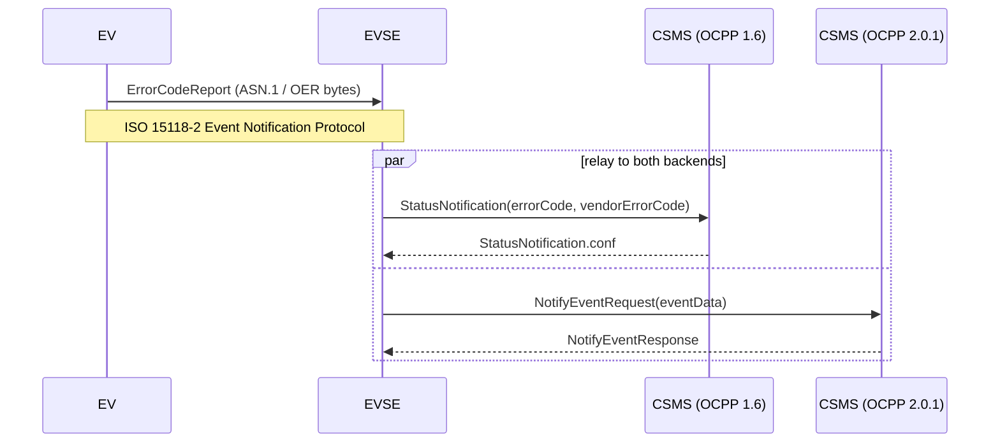

# Demo Architecture

This demo shows one Unified Error Code travelling the full path from an
EV to an EVSE to a charging management system (CSMS), and simulates an
EVSE that is simultaneously connected to two CSMS backends — one
speaking OCPP 2.0.1, one speaking the older OCPP 1.6 — to show that a
single Unified Error Code can be reported over either without changing
what error was actually detected.

## Actors

-  **EV** (`ev.py`) — builds an `ErrorCodeReport` (the ASN.1 message
   defined in `specification/protocol/UnifiedErrorCodeExchange.asn1`)
   and encodes it as it would be sent over ISO 15118-2's Event
   Notification Protocol.
-  **EVSE** (`evse.py`) — decodes the report and relays it, unchanged
   in meaning, to both connected CSMS backends at the same time. It
   translates the single `codeName` into each protocol's native error
   representation rather than tunnelling the ASN.1 message through
   OCPP.
-  **CSMS (OCPP 1.6)** and **CSMS (OCPP 2.0.1)** (`csms_ocpp16.py`,
   `csms_ocpp201.py`) — minimal mock backends, one per protocol
   version, each a `websockets` server accepting exactly the OCPP
   message the EVSE sends and acknowledging it.
-  **`run_demo.py`** — starts both mock CSMS backends, then runs the
   EV → EVSE → CSMS flow once, printing each step.

## Protocol translation

The EVSE does not forward the ASN.1 message as-is; each backend gets a
payload built from native OCPP fields, populated from the same
`ErrorCodeReport`:

| Field | OCPP 1.6 `StatusNotification` | OCPP 2.0.1 `NotifyEventRequest` |
|---|---|---|
| Which side/what happened | `error_code` (closest matching `ChargePointErrorCode`, else `OtherError`) + `status=Faulted` | `event_data[].tech_code` |
| Exact Unified Error Code | `vendor_error_code` = `codeName`, `vendor_id` = `"org.charin.unified-error-codes"` | `event_data[].tech_code` = `codeName` |
| When it happened | `timestamp` | `event_data[].timestamp` |

OCPP 1.6's `ChargePointErrorCode` is a small, fixed vocabulary; where a
Unified Error Code name matches one of its values directly (e.g.
`OverCurrentFailure`), it is used, so 1.6-only backends still get a
standard error code — the exact Unified Error Code name always rides
along in `vendorErrorCode` regardless. OCPP 2.0.1's `NotifyEventRequest`
was designed for exactly this kind of open-ended event/alarm reporting,
so `tech_code` carries the Unified Error Code name directly.

## Why simulate two backends at once

A charging station operator upgrading its fleet from OCPP 1.6 to 2.0.1
does not do so instantaneously across every backend and every station.
Demonstrating the EVSE relaying the *same* detected error to both
protocol versions in parallel shows that this message design does not
force a hard cutover: a single Unified Error Code, once reported by an
EV, is representable — completely, not just as best-effort free text —
in whichever OCPP version a given backend still speaks.

## Non-goals / simplifications

This is a documentation demo, not a reference implementation:

-  No real ISO 15118-2 transport (SLAC, SDP, TLS) — the EV → EVSE leg
   is a direct in-process function call carrying the same OER bytes
   that would cross the wire.
-  No OCPP security profiles (TLS, Basic Auth) — the mock CSMS
   backends accept any connection on `localhost`.
-  No retry, backoff, or persistence — each relay is a single
   request/response pair.
-  Only the one error path relevant to this message is implemented;
   full charge-session message flows (`BootNotification`,
   `Authorize`, `TransactionEvent`, …) are out of scope.

## Prior art

[EVerest](https://github.com/EVerest/everest-core) is an existing
open-source EVSE/CS software stack, and its OCPP modules inform how
this demo maps a detected error onto each protocol's native fields:

-  OCPP 1.6: EVerest's `StatusNotification.req` carries `errorCode`,
   `status`, and optional `vendorId`/`vendorErrorCode` fields — this
   demo mirrors that shape directly.
-  OCPP 2.0.1: EVerest's `EventDataType` (used by `NotifyEvent.req`)
   carries `trigger`, `eventNotificationType`, `techCode`, and
   `actualValue` — this demo uses the same fields to carry the Unified
   Error Code.

EVerest's own `OCPPmulti` module supports OCPP 1.6 **or** 2.0.1 per
station, selected by configuration — it does not run both generations
concurrently against two backends today. Running both in parallel here
is a deliberate simplification for this demo, to show that a single
Unified Error Code is representable in either protocol, not a claim
about how EVerest itself is deployed.
