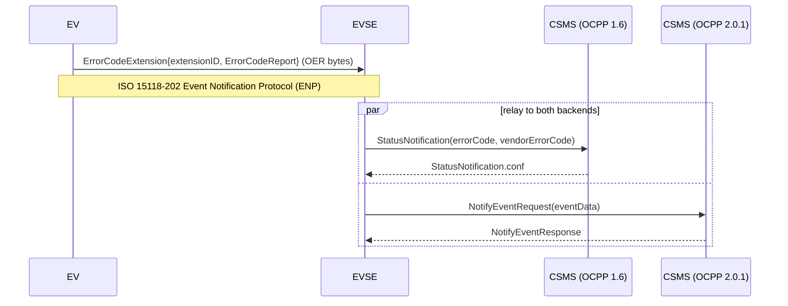

# Demo Architecture

This demo shows one Unified Error Code travelling the full path from an
EV to an EVSE to a charging management system (CSMS), and simulates an
EVSE that is simultaneously connected to two CSMS backends — one
speaking OCPP 2.0.1, one speaking the older OCPP 1.6 — to show that a
single Unified Error Code can be reported over either without changing
what error was actually detected.

## Actors

-  **EV** (`ev.py`) — builds an `ErrorCodeReport` (the ASN.1 message
   defined in `specification/protocol/UnifiedErrorCodeExchange.asn1`),
   wraps it as an ENP extension (`ErrorCodeExtension`), and encodes it
   as it would be sent over the Event Notification Protocol (ENP)
   specified by ISO 15118-202. See "ENP extension wrapping" below.
-  **EVSE** (`evse.py`) — unwraps the extension, decodes the report,
   and relays it, unchanged in meaning, to both connected CSMS backends
   at the same time. It translates the single `codeName` into each
   protocol's native error representation rather than tunnelling the
   ASN.1 message through OCPP.
-  **CSMS (OCPP 1.6)** and **CSMS (OCPP 2.0.1)** (`csms_ocpp16.py`,
   `csms_ocpp201.py`) — minimal mock backends, one per protocol
   version, each a `websockets` server accepting exactly the OCPP
   message the EVSE sends and acknowledging it.
-  **`demo.py`** — starts both mock CSMS backends, then runs the
   EV → EVSE → CSMS flow once, printing each step.

## ENP extension wrapping

ISO 15118-202 carries ENP extensions in a registry whose entries pair a
unique 16-octet identifier with the ASN.1 type that identifier selects.
ISO publishes that registry as a machine-readable ASN.1 module,
[`ENPExtensions.asn`](https://standards.iso.org/iso/pas/15118/-202/ed-1/en/ENPExtensions.asn),
separately from the paywalled prose document. Six extensions are
registered today (EVSE grid information, grid code impact level, EV/EVSE
stop reason, EV/EVSE derating reason), none for a general-purpose error
code.
[GitHub issue #65](https://github.com/charinev/unified-error-codes/issues/65)
proposes adding `ErrorCodeReport` as a new entry for exactly that
purpose — see the "ENP Extension Registration" section of
`specification/protocol/definitions_ErrorCodeExchangeMessage.rst` for
the proposal and its status.

ISO's registry is built on an ASN.1 Information Object Class (ITU-T
X.681), so that the payload's type is inferred from the identifier at
compile time. This demo does not implement that literally: per the
EVerest project's own investigation
([EVerest/EVerest-archived#259](https://github.com/EVerest/EVerest-archived/issues/259)),
current open-source ASN.1 compilers can't yet process that construct.
The demo therefore defines its own stand-in in
[`DemoEnpExtension.asn1`](DemoEnpExtension.asn1) — a plain
`{ extensionID, extensionValue }` pair, with `extensionValue` an opaque,
separately-encoded `ErrorCodeReport` — so the wire structure can be shown
end to end. That file is demonstration scaffolding: what #65 proposes
registering is `ErrorCodeReport` itself, not this wrapper.

## Protocol translation

The EVSE does not forward the ASN.1 message as-is; each backend gets a
payload built from native OCPP fields, populated from the same
`ErrorCodeReport`:

| `ErrorCodeReport` field | OCPP 1.6 `StatusNotification` | OCPP 2.0.1 `NotifyEventRequest` |
|---|---|---|
| `errorCode.codeName` (exact) | `vendor_error_code`, with `vendor_id` = `"org.charin.unified-error-codes"` | `event_data[].tech_code` and `event_data[].actual_value` |
| `errorCode.codeName` (normalized) | `error_code` — the closest matching `ChargePointErrorCode`, else `OtherError` | — (no fixed vocabulary to normalize into) |
| `errorCode.source` | *not represented* — see below | `event_data[].tech_info` (`source=ev` / `source=evse`) |
| `metadata.sessionContext.timestamp` | `timestamp` | `event_data[].timestamp` |
| (fault state) | `status=Faulted` | `trigger=Alerting`, `event_notification_type=HardWiredNotification` |

OCPP 1.6's `ChargePointErrorCode` is a small, fixed vocabulary; where a
Unified Error Code name matches one of its values directly (e.g.
`OverCurrentFailure`), it is used, so 1.6-only backends still get a
standard error code — and the exact Unified Error Code name always rides
along in `vendorErrorCode` regardless. OCPP 2.0.1's `NotifyEventRequest`
was designed for exactly this kind of open-ended event/alarm reporting,
so `tech_code` carries the Unified Error Code name directly.

One asymmetry is worth calling out: **OCPP 1.6 has no field for
`errorCode.source`**, so a 1.6-only backend cannot tell whether the EV
or the EVSE detected the fault, even though the ISO 15118-202 message
carries that distinction. OCPP 2.0.1 can convey it (here via
`tech_info`). Anything richer than the error code name itself is where
the two protocol generations stop being equivalent.

## Why simulate two backends at once

A charging station operator upgrading its fleet from OCPP 1.6 to 2.0.1
does not do so instantaneously across every backend and every station.
Demonstrating the EVSE relaying the *same* detected error to both
protocol versions in parallel shows that this message design does not
force a hard cutover: the error code name itself survives intact in
either version, in a dedicated field rather than as free text. What does
*not* survive equally is the surrounding context — see the asymmetry
noted above — which is the honest cost of staying on 1.6.

## Non-goals / simplifications

This is a documentation demo, not a reference implementation:

-  No real ISO 15118-202 (ENP) transport, and no ISO 15118-2/-20 SLAC,
   SDP, or TLS — the EV → EVSE leg is a direct in-process function
   call. It carries a real OER encoding of the report, but not the ENP
   message framing that would surround it on the wire.
-  No OCPP security profiles (TLS, Basic Auth) — the mock CSMS
   backends accept any connection on `localhost`.
-  No retry, backoff, or persistence — each relay is a single
   request/response pair.
-  Only the one error path relevant to this message is implemented;
   full charge-session message flows (`BootNotification`,
   `Authorize`, `TransactionEvent`, …) are out of scope.

## Prior art

**ISO 15118-202** ("Extensible SECC Discovery Protocol and Event
Notification Protocol") is a real, distinct ISO document — currently
at [Draft PAS stage](https://www.iso.org/standard/89759.html), not yet
a published International Standard — that specifies ESDP and ENP for
use *alongside* ISO 15118-2 and ISO 15118-20. Its scope statement:
"These protocols... offer additional functionality that makes the
digital communication for EV charging more robust and allows to
better determine the reason of failures." That is exactly the gap this
message closes. Its machine-readable ASN.1 schema files are published
openly by ISO, independent of the (paywalled) prose document:
[`ENPExtensions.asn`](https://standards.iso.org/iso/pas/15118/-202/ed-1/en/ENPExtensions.asn)
and
[`ESDPExtensions.asn`](https://standards.iso.org/iso/pas/15118/-202/ed-1/en/ESDPExtensions.asn)
— see "ENP extension wrapping" above for how this demo uses the former.

**Three open issues in this repository are directly relevant** and were
the main source for how this demo integrates with ENP:

-  [#35 "Decide on Schema Format"](https://github.com/charinev/unified-error-codes/issues/35) —
   records the group's starting tension (OCPP uses JSON, ISO 15118-202
   uses ASN.1) that this message format and its OCPP field-mapping both
   answer.
-  [#62 "Error Code Extension"](https://github.com/charinev/unified-error-codes/issues/62) —
   an earlier, richer draft schema (event lifecycle, error
   classification, charge context, diagnostics) with several questions
   still unresolved by the working group (e.g. analog vs. digital
   sessions, one message vs. per-side messages). Deliberately not
   adopted here in full, since #61 (which this message implements)
   asked for the *minimum* required set, and much of #62 remains
   under active discussion.
-  [#65 "ISO 15118-202 Error Code ENP Extension Definition"](https://github.com/charinev/unified-error-codes/issues/65) —
   proposes registering `ErrorCodeReport` as an ENP extension; the UUID
   this demo uses is the candidate proposed there, still unratified.

[EVerest](https://github.com/EVerest/everest-core) is an existing
open-source EVSE/CS software stack. Its own archived issue tracker has
a matching thread,
[EVerest/EVerest-archived#259 "Integration ISO15118-202"](https://github.com/EVerest/EVerest-archived/issues/259),
which independently confirms ISO 15118-202 uses ASN.1 for four
messages and documents that `asn1c` cannot yet compile the Information
Object Class construct its extension registry depends on — the basis
for this demo's simplified stand-in (see above). A fork,
[NatLabRockies/everest-core](https://github.com/NatLabRockies/everest-core),
adds a prototype of ESDP (not ENP) based on an earlier draft of
ISO 15118-202, with its own ASN.1 module
([`esdp_extensions_new.asn`](https://github.com/NatLabRockies/everest-core/blob/main/modules/EvseV2G/asn1/esdp_extensions_new.asn))
— superseded here by the current, official `ESDPExtensions.asn` linked
above, but confirming this is a real, independently-verified engineering
effort, not a one-off.

No open ENP reference implementation carrying an error code was found
anywhere, so this demo's OCPP field mappings are grounded in EVerest's
general-purpose OCPP modules instead:

-  OCPP 1.6: EVerest's `StatusNotification.req` carries `errorCode`,
   `status`, and optional `vendorId`/`vendorErrorCode` fields — this
   demo mirrors that shape directly.
-  OCPP 2.0.1: EVerest's `EventDataType` (used by `NotifyEvent.req`)
   carries `trigger`, `eventNotificationType`, `techCode`, and
   `actualValue` — this demo uses the same fields to carry the Unified
   Error Code.

EVerest's own `OCPPmulti` module supports OCPP 1.6 **or** 2.0.1 per
station, selected by configuration — it does not run both generations
concurrently against two backends today. Running both in parallel here
is a deliberate simplification for this demo, to show that a single
Unified Error Code is representable in either protocol, not a claim
about how EVerest itself is deployed.
